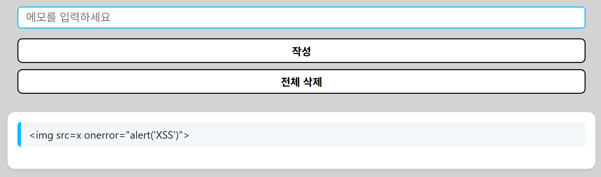

### /page

기능  
    -인덱스 클릭시 해당 페이지로 이동시키면 좋겠다.
        -css를 통해 각 인덱스 버튼에 커서를 올릴시 배경색이 검정으로 바뀌고 클릭시 흰색으로로 다시 바뀌는 기능구현

-현재 인덱스 목록 
    -Login
    -Memo
    -과제3

### login page

기능 
    -로그인 기능 구현
    -아이디 type은 text로 사용자가 한줄의 일반 텍스트를 입력하게함
    -비밀번호 type은 password로 사용자가 비밀번호를 입력해도 점으로 가려 보안성을 증대시킴
    -하단의 login버튼을 클릭시 로그인은 아직 안됨.
        -css를 통해 커서를 올릴시 배경이 흰색이 되게함
        -css를 통해 버튼을 클릭시 배경이 다시 파란색으로 돌아오게함

### login.js

기능
    - loginform이 동작할때 기본 제출을 막음 (비동기로 처리)
    - username과과 pw값을 받아와서 pw에 sha 256 해시 처리를 한다
    - 해시 처리를 한 값(abcd)을 서버 sql과 값을 비교해보니 대소문자가 달라서 대문자 처리를 진행행 
    - 서버에 비밀번호와 아이디를 전송한다(POST요청)
    - 서버 응답을 처리해서 JSON으로 변환한다
    - 서버에서 반환한 message를 확인해서 "로그인 성공"이면 로그인 성공이라는 alert창을 띄움 그렇지 않으면 로그인 실패alert창을 띄움 
    
### memo page
    - 기능  
    - 인덱스 페이지에서 Memo 버튼 클릭 시 /memo 페이지로 이동  
    - 메모 입력 후 '작성' 버튼을 누르면 하단에 입력한 메모가 바로 보임  
    - 전체 삭제 버튼을 누르면 모든 메모를 한 번에 삭제  
    - fetch를 이용해 /api/memo (POST), /api/memo/delete (POST), /api/memo (GET)과 연동  
    - css를 통해 전체적인 스타일 통일
    - 작성/삭제 버튼에 커서를 올리면 배경색이 바뀌고, 클릭하면 다시 돌아오도록 구현

### xss
    - 클라이언트에서는 innerText로만 출력해서, 스크립트 입력해도 실행되지 않게 구현
    

### csrf
    - POST 요청은 fetch API로만 이뤄지게함
    - 사실 인증 로그인 세션,쿠키 등이 없어서 현 상태에서 공격 당할 가능성 낮음